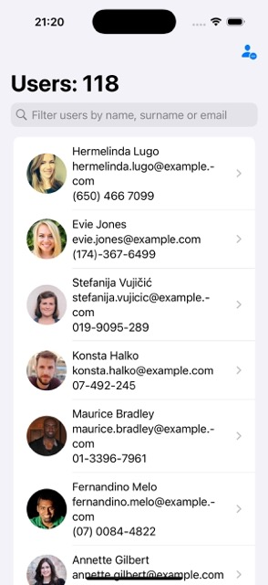
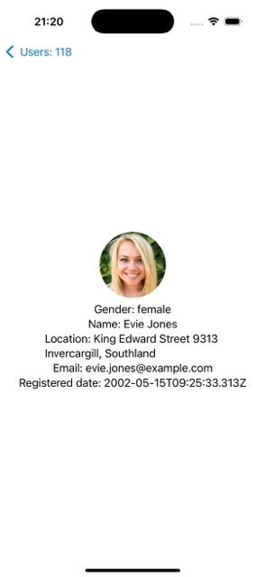

# RandomUserCodingChallenge

## Task

You are working for a company showing random users information (RandomUser Inc.). As a good company based on random users data they want to show random information about random users.

Your task for this code test is to design an Android/iOS application (the one you prefer) with these requirements:

    Download a list of random users from http://randomuser.me/ API.

        Be careful, some users can be duplicated. You should take this into account and do not show duplicated users. If Random User API returns the same user more than once you have to store just one user inside your system.

    Show a list of random users with this information:

        User name and surname.

        User email.

        User picture.

        User phone.

    Add a button or any similar infinite scroll mechanism to retrieve more users and add them to your current users list.

    Add a button to each cell or a similar interaction to delete users. If you press that button your user will not be shown anymore in your user list. Even if the user is part of a new server side response.

    Your user interface should contain a textbox to filter users by name, surname or email. Once the user stop typing, your list will be updated with users that matches with the search term.

    If you press the cell you have to show another view with the user detailed information:

        User gender.

        User name and surname.

        User location: street, city and state.

        Registered date.

        User email.

        User picture.

    The user information should be persistent across application sessions.

        That means that if I open the application for the first time and I see "John Smith" as the first contact, I should always see the same contact in that position until I remove it or uninstall the application, no matter how many times I relaunch the app.

    Test your code, think in the most important parts of your application and write tests.

    Try to solve this code test like a real life project. Think in the architecture and design of your model and try to implement it as modular as possible.

        At the same time don't over engineer your project. Find a good balance between modularization and readability.

## API Description

You can obtain a list of random users in this URL: http://api.randomuser.me/?results=40. The full documentation of the API is available in the following link: https://randomuser.me/documentation.

## Demo

